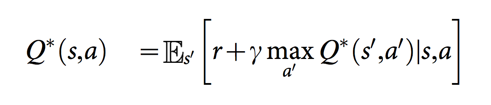
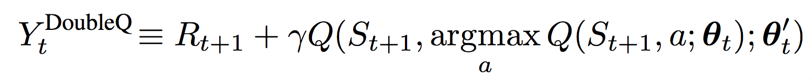
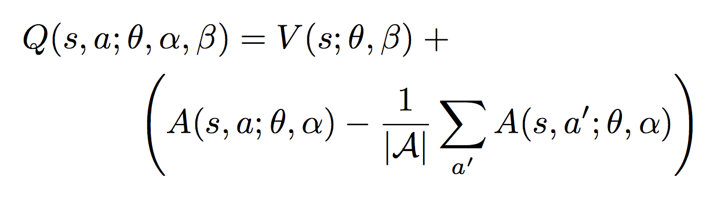
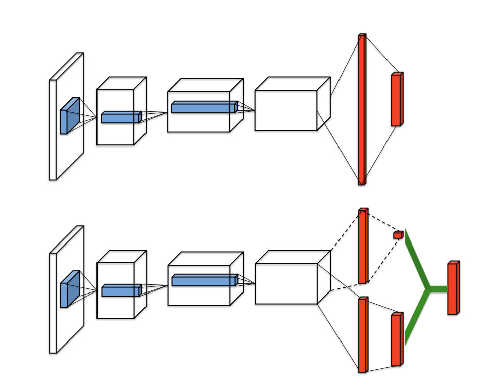
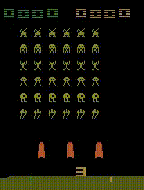
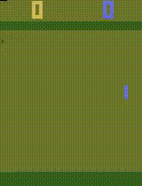
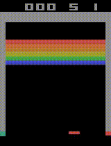

# Vanilla DQN, Double DQN, and Dueling DQN in PyTorch


## Description
This repo is a [PyTorch](https://www.pytorch.org/) implementation of Vanilla DQN, Double DQN, and Dueling DQN based off these papers.

- [Human-level control through deep reinforcement learning](http://www.nature.com/nature/journal/v518/n7540/full/nature14236.html)
- [Deep Reinforcement Learning with Double Q-learning](https://arxiv.org/abs/1509.06461)
- [Dueling Network Architectures for Deep Reinforcement Learning](https://arxiv.org/abs/1511.06581)

Starter code is used from [Berkeley CS 294 Assignment 3](https://github.com/berkeleydeeprlcourse/homework/tree/master/hw3) and modified for PyTorch with some guidance from [here](https://github.com/transedward/pytorch-dqn). Tensorboard logging has also been added (thanks [here](https://github.com/yunjey/pytorch-tutorial/blob/master/tutorials/04-utils/tensorboard) for visualization during training in addition to what the Gym Monitor already does).

## Background
Deep Q-networks use neural networks as function approximators for the action-value function, Q. The architecture used here specifically takes inputs frames from the Atari simulator as input (i.e., the state) and passes these frames through two convolutional layers and two fully connected layers before outputting a Q value for each action. 

<p align="center">
    
</p>

[Human-level control through deep reinforcement learning](http://www.nature.com/nature/journal/v518/n7540/full/nature14236.html) introduced using a experience replay buffer that stores past observations and uses them as training input to reduce correlations between data samples. They also used a separate target network consisting of weights at a past time step for calculating the target Q value. These weights are periodically updated to match the updated, latest set of weights on the main Q network. This reduces the correlation between the target and current Q values. Q target is calculated as below.

<p align="center">
    
</p>

Noting that vanilla DQN can overestimate action values, [Deep Reinforcement Learning with Double Q-learning](https://arxiv.org/abs/1509.06461) proposes an alternative Q target value that takes the argmax of the current Q network when inputted with the next observations. These actions, together with the next observations, are passed into the frozen target network to yield Q values at each update. This new Q target is shown below.

<p align="center">
    
</p>

Finally, [Dueling Network Architectures for Deep Reinforcement Learning](https://arxiv.org/abs/1511.06581) proposes a different architecture for approximating Q functions. After the last convolutional layer, the output is split into two streams that separately estimate the state-value and advantages for each action within the state. These two estimations are then combined together to generate a Q value through the equation below. The architecture is also shown here in contrast to traditional Deep Q-Learning networks.

<p align="center">
    
    
</p>

## Dependencies

- Python 2.7
- [PyTorch 0.2.0](http://pytorch.org/)
- [NumPy](http://www.numpy.org/)
- [OpenAI Gym](https://github.com/openai/gym)
- [OpenCV 3.3.0](https://pypi.python.org/pypi/opencv-python)
- [Tensorboard](https://github.com/tensorflow/tensorboard)

## Usage

- Execute the following command to train a model on vanilla DQN:

```
$ python main.py train --task-id $TASK_ID
```

From the Atari40M spec, here are the different environments you can use:
* `0`: BeamRider
* `1`: Breakout
* `2`: Enduro
* `3`: Pong
* `4`: Qbert
* `5`: Seaquest
* `6`: Spaceinvaders

Here are some options that you can use:
* `--gpu`: id of the GPU you want to use (if not specified, will train on CPU)
* `--double-dqn`: 1 to train with double DQN, 0 for vanilla DQN 
* `--dueling-dqn`: 1 to train with dueling DQN, 0 for vanilla DQN

## Results

### SpaceInvaders

Sample gameplay

<p align="center">
    
</p>

### Pong

Sample gameplay

<p align="center">
    
</p>

### Breakout

Sample gameplay

<p align="center">
    
</p>


